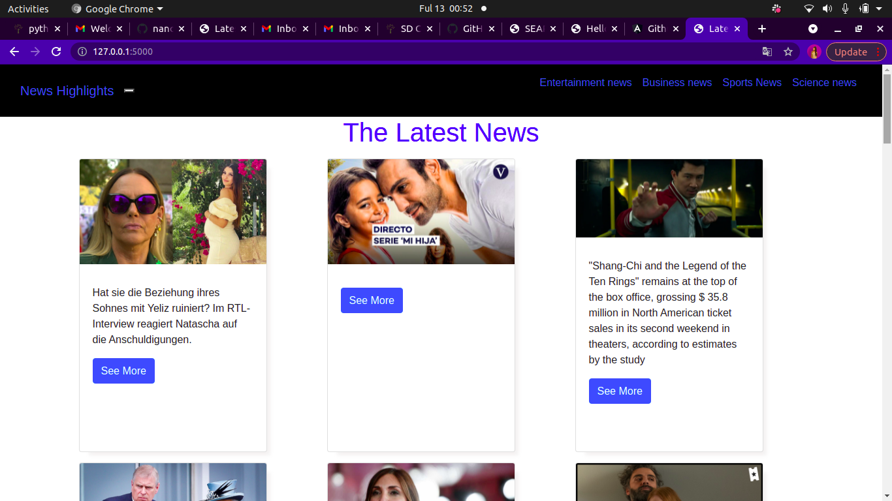
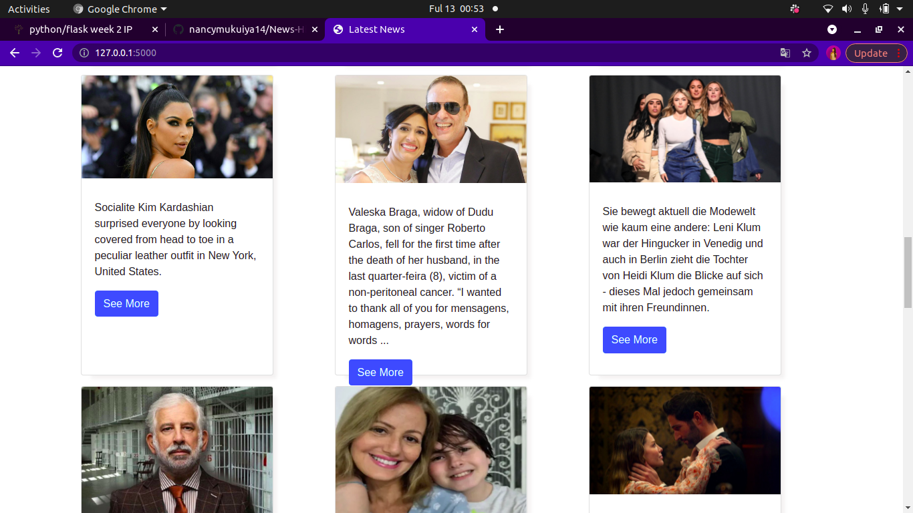

## NEWS-HIGHLIGHT
## Developed by:Nancy Kigotho
## Description
* A python application that offers users with the latest news. It is also includes different sources.
## Set-up installation.

* Fork the project.
* clone to your project.
* Run chmod a+x start.sh
* start.sh

## Set-up Requirements.
* web browser
* git
* pip

## Technologies used.
* Python
* HTML
* CSS
* Bootstrap
## known Bugs
Thankfully i have no bugs.
## Contact Information.
Incase you have any questions or you would want to work with me contact me via:
Twitter:@mukuiyakigotho
Instagram:@hey_its_nancy
Email:nancykigotho14@gmail.com
Telephone:0705814086 
## Live link
https://latest-mpasho.herokuapp.com/
## Images.

## License
MIT licence
